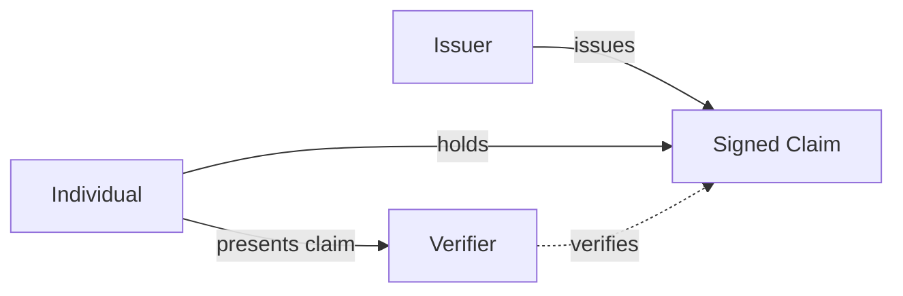

# Cvera | Verifiable Claim Tokens

**Claims. Verified.**

A prototype system for **user-held, cryptographically verifiable claims** that enables trusted issuers to create signed records about individuals, which can be independently verified without relying on direct access to the issuing authority.

Cvera defines a generalized framework for **portable, verifiable human claims** across domains.

## What this demo shows

- Issuance of a verifiable claim token  
- User-held credential (portable JSON)  
- Independent verification:
  - signature validation  
  - trust chain evaluation  
  - revocation checking  

## Claim types (illustrative)

This model supports a wide range of attestable claims, including:

- Professional employment roles and organizational relationships  
- Academic qualifications and certifications  
- Licenses and regulatory status  
- Legal identity changes  
- Achievements, affiliations, and records  

## Why this matters

As AI accelerates the creation of synthetic and unverifiable information, trust in claims about individuals is eroding. Yet, verification still relies on manual checks across fragmented systems.
Cvera explores a model where claims become:

- **Portable** — held by the individual  
- **Verifiable** — cryptographically provable  
- **Independent** — validated without contacting the issuer  
- **Auditable** — with clear trust and revocation semantics  

This shifts systems from **trusting claims** to **verifying proof**.

## Vision

A world where individuals hold their own verifiable records, and institutions rely on **independent verification rather than intermediaries** to establish truth.

## Verification Model

Cvera replaces reconstructed, intermediated verification with a simple, inspectable model based on authoritative issuance and independent verification.

In this model:

- An issuer creates a signed claim  
- The individual holds that claim  
- A verifier can independently validate it without contacting the issuer

